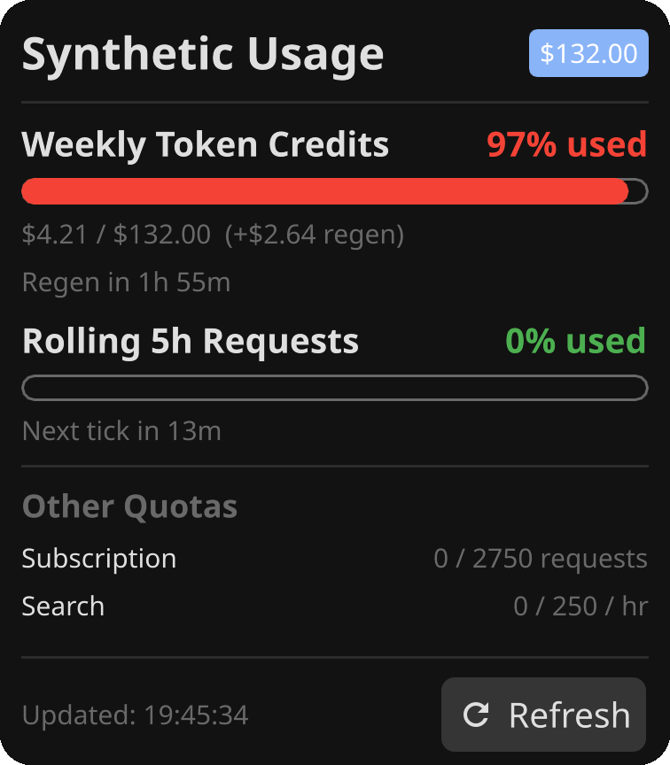

# Plasma Synthetic Usage

A Plasma 6 panel widget for synthetic.new quotas. It shows weekly credits and the rolling five-hour request limit.



## Requirements

- KDE Plasma 6
- Python 3 and a synthetic.new API key

Save the key in `~/.config/synthetic/api-key`, then restrict the file:

```bash
chmod 600 ~/.config/synthetic/api-key
```

Alternatively use `SYNTHETIC_API_KEY` in your environment profile

## Install

```bash
git clone https://github.com/JungleM0nkey/plasma-synthetic-usage.git
cd plasma-synthetic-usage
kpackagetool6 --type Plasma/Applet --install .
```

Open **Add Widgets** and add **Synthetic Usage** to a panel.

License: GPL-3.0-or-later.
